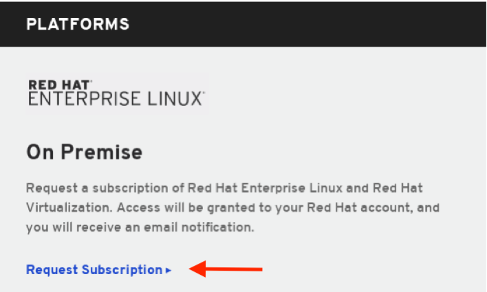
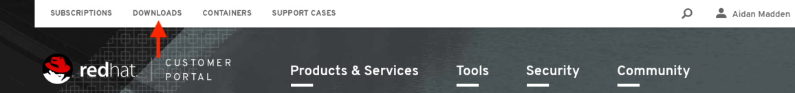
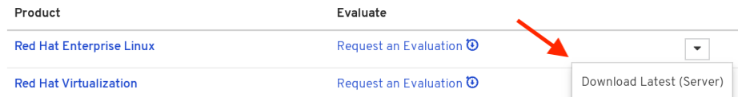
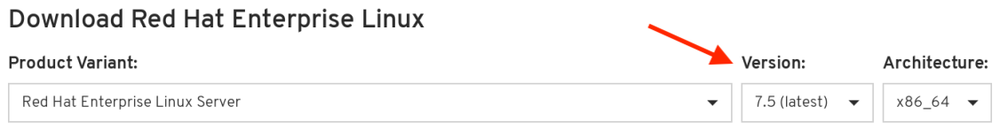
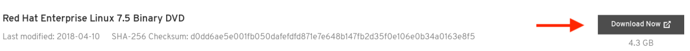

= Introduction to Red Hat Connect API
ifdef::env-github[]
:imagesdir: ../assets/
endif::[]
:toc:
:toc-placement!:

This walkthrough is meant for members of the https://connect.redhat.com[Red Hat Partner Connect] program looking to publish a container image in the https://access.redhat.com/containers/[Red Hat Container Catalog(RHCC)]. The scope of this guide is to cover the installation and setup of RHEL, subscription manager, and Docker. You will also be shown how to upload built containers to Red Hat Connect for certification and publishing to RHCC.  + 

toc::[]

== Obtain Active Subscription for RHEL
Technology partners can request no cost software subscriptions through the Red Hat Connect site https://connect.redhat.com/benefits/software-access[here]. + 

Scroll down, choose the platform to request access for, and click “request subscription”. You will receive an email regarding the status of your request. + 

{sp} + 

== Install RHEL
Once you have obtained an active subscription, we can download RHEL. Head to the https://access.redhat.com/[Customer Portal].

*_Login and click "Downloads"_* +

{sp} + 

*_Select “Download Latest (Server)”_* +

{sp} + 

*_Select the version of RHEL you wish to download_* + 

{sp} + 

*_Click “download now” next to the file format of your choosing_* + 

{sp} + 

== Register and Setup Subsciption Manager
== Install Docker
== Build Container
== Upload Image to Red Hat Connect
